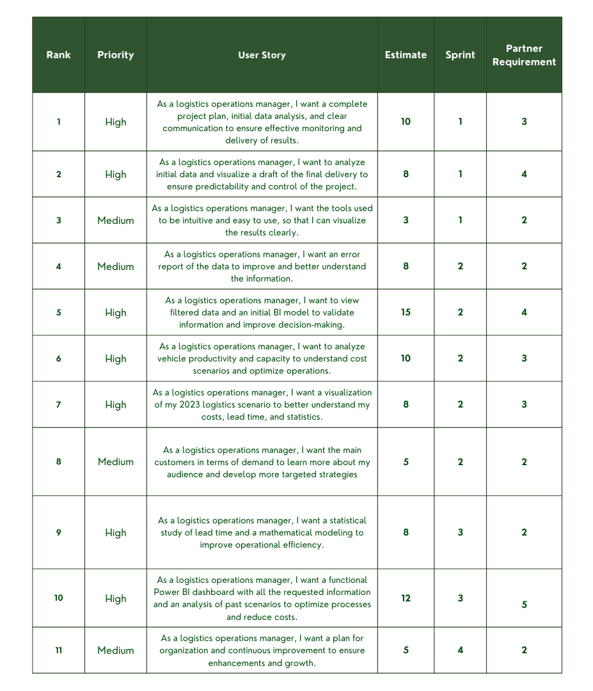

# Who we are?

*"Connecting the World!"*

Welcome ESPHERA LOGTECH, where we connect the world with intelligent and agile logistics solutions. Our mission as a group of students is to integrate technology and planning to efficiently and safely meet the needs of each client. With an innovative approach, we transform the routing sector, driving global mobility with precision and excellence.

# Index

* [Project](#Project-(API))
* [Team](#Team)
* [Project Objective](#Project-Objective)
* [Estrategic](#Estrategic)
* [Colab and Language R](#Colab_and_Language_R)
* [Sprints](#Sprints)
* [User Stories](#User-Stories)

# Project (API) 
Project based on the Agile SCRUM methodology, widely used by project managers, with the goal of developing Proactivity, Autonomy, Collaboration, and a Results-Oriented Mindset in students. This method stands out for its structured approach to task organization and execution, ensuring effective, precise, and goal-aligned deliveries. As a result, it fosters optimized technological development, driving efficiency and innovation.

# Team
|    Function     | Name                                  |                                                                                                                                                      LinkedIn & GitHub                                                                                                                                                      |
| :-----------: | :------------------------------------ | :-------------------------------------------------------------------------------------------------------------------------------------------------------------------------------------------------------------------------------------------------------------------------------------------------------------------------: |
| Product Owner |   Jennifer Senne         |                    |
| Scrum Master  | Stela Lúcio |            |
|  Team Member  | Bruno Canuto        |                      |
| Team Member   | Emilly Tamanhoni            |                  |
|  Team Member  | Fagner Pereira                |                  |
|  Team Member  | Kaick Monfredini                 |       |

# Project Objective
Our goal is to develop an optimized routing solution for a brewery’s delivery trucks by analyzing logistical data related to freight, factories, transported volumes, and load capacities. The proposal aims to identify more efficient opportunities that reduce operational costs, increase fleet utilization, and ensure proper demand fulfillment, contributing to the optimization of the company's logistical planning.

# Estrategic
At our company, we combine technology, data analysis, and creativity to develop personalized solutions that optimize time, reduce costs, and drive results. Our strategy is centered on a deep understanding of each client’s needs, applying market intelligence and digital tools to turn challenges into opportunities.

[Click here](Sprint2/Estrategias.pdf)

# Colab and Language R
For the implementation of the codes developed in the project, we used Google Colab, which allows for practical and efficient data manipulation and analysis. The tool is widely used in data science and machine learning, offering cloud-based computing resources. All the developed structures and their explanations are provided below.

> Data analysis and processing
In the initial phase, we performed the main analyses, such as mapping clients and factories, resolving errors found in the dataset, and ensuring the data was clean and structured for the next steps of the project.

[Analysis](https://colab.research.google.com/drive/1fle8LGHwVCtldodr0XxIFnxx__x676Hp?usp=sharing)

> Efficiency of factories and clients
The efficiency was evaluated based on the freight cost and the quantity transported, following the logic that the higher the freight cost, the greater the quantity that should be transported. The code was developed using the DEA (Data Envelopment Analysis) method, and to run it, the attached spreadsheet must be used.

[Efficiency](https://colab.research.google.com/drive/1m3M9kJhroMLSICGGk37iRwBq8IoMJJ0L?usp=sharing) and

> Cost optimization
For the optimization, we used the factories' capacity, customer demand, and the average unit cost of each route. The goal was to optimize the 2023 freight cost, which amounted to R$25,477,365.12.

[Optimization](https://colab.research.google.com/drive/14dvOypDADRu2HdBGbE-o2B2jg0R4X2Re?usp=sharing)

# Sprints

Sprint | Forecast | Status| Report|Apresentacion|
|------|--------|------|--------|--------|
|01 | 14/04/2025 | Completed|-|[View Apresentation](Sprint1/Apresentaçao_sprint1.pdf) |
|02|  09/05/2025| Completed|[View Report](Sprint2/Relatório_Sprint2.pdf)|[View Dashboard](Sprint2/Dashboard_Sprint2.pdf)/[View Apresentation](Sprint2/Sprint2.pdf)|
|03| 30/05/2025 | Completed |[View Report](Sprint2/Relatório_Sprint2.pdf)| [View Dashboard]()/[View Apresentation]()|
|Solutions Fair|17/06/2025 |Developing|[View Report](Sprint2/Relatório_Sprint2.pdf)| [View Dashboard]()/[View Apresentation]()|
  
# User Stories

 > Product Backlog

      

  
# Sprint 1. Conception

- [X] Understanding the client's proposal;
- [X] Presentation of initial ideas;
- [X] Initial data mapping;
- [X] Structuring the idea of a possible final product;
- [X] Preparing the sprint presentation.

# Sprint 2. Project Development

- [X] Start building the Power BI structure;
- [X] Analyze the data and routes;
- [X] Filter and identify promising data;
- [X] Data quality assessment;
- [X] Software updates;
- [X] Structure the Sprint 2 report.
      
# Sprint 3. Operationalization

- [X] Finalization and delivery of the dashboard;
- [X] Data review;
- [X] Preparation for the final presentation;
- [X] Efficiency and optimization.

