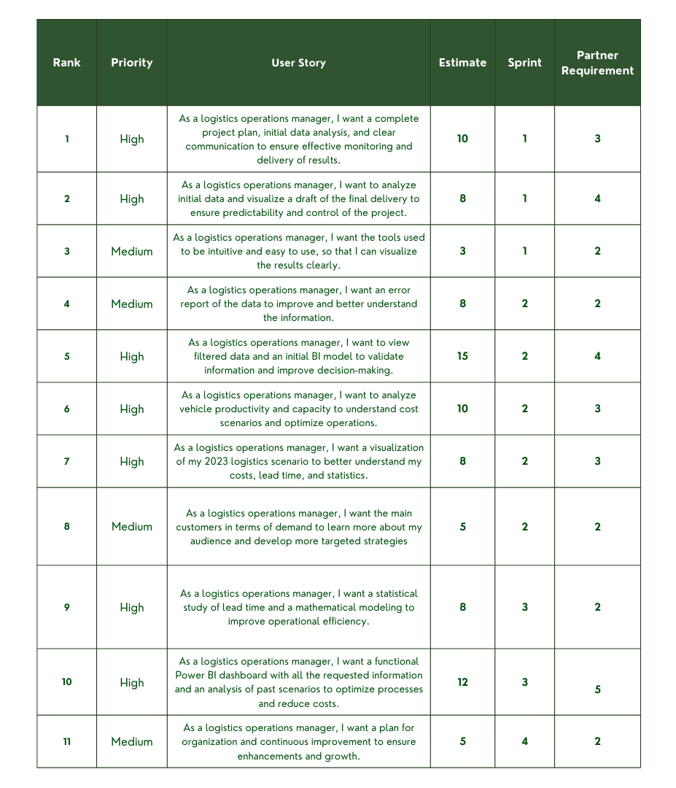

# Who we are?

*"Connecting the World!"*

Welcome ESPHERA LOGTECH, where we connect the world with intelligent and agile logistics solutions. Our mission as a group of students is to integrate technology and planning to efficiently and safely meet the needs of each client. With an innovative approach, we transform the routing sector, driving global mobility with precision and excellence.

# Index

* [Project](#Project-(API))
* [Team](#Team)
* [Project Objective](#Project-Objective)
* [Sprints](#Sprints)
* [User Stories](#User-Stories)

# Project (API) 
Project based on the Agile SCRUM methodology, widely used by project managers, with the goal of developing Proactivity, Autonomy, Collaboration, and a Results-Oriented Mindset in students. This method stands out for its structured approach to task organization and execution, ensuring effective, precise, and goal-aligned deliveries. As a result, it fosters optimized technological development, driving efficiency and innovation.

# Team
|    Function     | Name                                  |                                                                                                                                                      LinkedIn & GitHub                                                                                                                                                      |
| :-----------: | :------------------------------------ | :-------------------------------------------------------------------------------------------------------------------------------------------------------------------------------------------------------------------------------------------------------------------------------------------------------------------------: |
| Product Owner |   Jennifer Senne         |                    |
| Scrum Master  | Stela Lúcio |            |
|  Team Member  | Bruno Canuto        |                      |
| Team Member   | Emilly Tamanhoni            |                  |
|  Team Member  | Fagner Pereira                |                  |
|  Team Member  | Kaick Monfredini                 |       |

# Project Objective
Our goal is to develop an optimized routing solution for a brewery’s delivery trucks by analyzing logistical data related to freight, factories, transported volumes, and load capacities. The proposal aims to identify more efficient opportunities that reduce operational costs, increase fleet utilization, and ensure proper demand fulfillment, contributing to the optimization of the company's logistical planning.

# Sprints

Sprint | Forecast | Status| Apresentacion|
|------|--------|------|--------|
|01 | 04/04/2025 | Finishing|[MVP](https//) |
|02|  25/04/2025|To do|[MVP](https//)|
|03| 16/05/2025 | To do | [MVP](https//)|
|Solutions Fair|29/05/2025 |To do  | [MVP](https//)|
|04 | 26/06/2025 | To do |[MVP](https//) |
  
# User Stories

 > Product Backlog

      

  
# Sprint 1. Conception

- [X] Understanding the client's proposal;
- [X] Presentation of initial ideas;
- [X] Initial data mapping;
- [X] Structuring the idea of a possible final product;
- [X] Preparing the sprint presentation.

